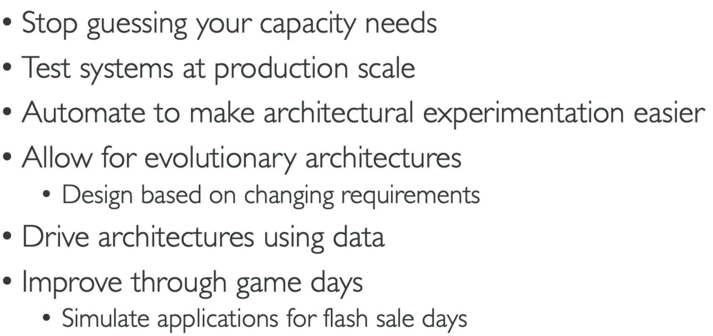
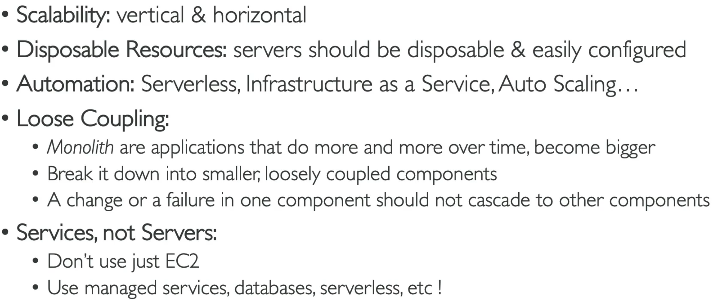
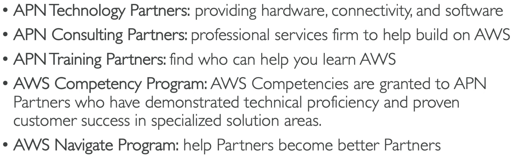

# AWS Architecting & Ecosystem

## General Guiding Principles

## AWS Cloud Best Practices - Design Principles

## Operational Excellence
Run & Monitor systems to deliver value.
- **Perform operations as code**
- **Annotate documentation** (clean)
- **Frequent, small, reversible changes**
- **Freq refine ops procedures**
- **Anticipate failure**
- **Learn**

## Security
Protect info, sys, & assets while delivering value.
- **Strong identity foundation**: principle of least privilege
- **Traceability**
- **Security at all layers**
- **Automate security best practice**
- **Protect data (transit, rest)**
- **Keep people away from data**
- **Prepare for security events**

## Reliability
Recover from infra or svc disruptions dynamically.
- **Test recovery procedures**
- **Auto recover from failure**
- **Scale horizontally to increase aggregate sys availability**
- **Stop guessing capacity**
- **Manage change in automation**

## Performance Efficiency
Use computing resources efficiently to meet sys requirements.
- **Democratize advanced techs**
- **Go global in mins**
- **Serverless archs**
- **Experiment more often**
- **Be aware of all AWS services**

## Cost Optimization
Run sys to deliver value at the lowest price point.
- **Consumption mode**
- **Measure overall efficiency**
- **Stop spending $ on Data center ops**
- **Analyze & attribute expenditure**
- **Use managed & app level services to reduce CoO**

## Sustainability
Minimizing the environmental impacts of running cloud workloads.
- **Understand ur impacts**
- **Have sustainability goals**
- **Max utilization**

## AWS Well-Architected Tool
(Free) **Review ur archs** against the 6 below pillars & **adopt archs best practices**

## AWS Right Sizing
Matching instance types & sizes to ur workload performance & capacity requirements
**at the lowest possible cost**
- **Scaling up is easy so, always start small**

Do it:
- **Before a Cloud Migration**
- **Continuously after the cloud onboarding process**

## Partner Network

## AWS Knowledge Center
Most Frequent & Common questions and requests.