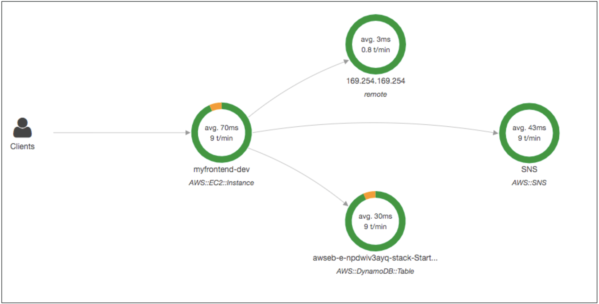

# Cloud Monitoring

## CloudWatch Metrics
Metrics:
- Variable
- Timestamps
- U can create dashboards

Important metrics:
- EC2 instances: Metrics every 5 minutes ($$$ for 1 minute)

## CloudWatch Alarms
Trigger notifications for any metric.
- **Alarm actions**
    - Auto Scaling
    - EC2 Actions: stop, terminate, reboot
    - SNS notifications
- Options: &, max, min...
- Period to evaluate
- e.g. **Billing alarm** (US-EAST1) on the CloudWatch Billing metric
- States: `OK`, `INSUFFICIENT_DATA`, `ALARM`

## CloudWatch Logs
Monitor, store, acces log files.
Collect log from:
- **Beanstalk**: app
- **ECS**: containers
- **Lambda**
- **CloudTrail**:based on filter
- **CloudWatch log agents**: EC2 machines/On/-premises servers
- **RouteS3**: DNS queries

## CloudWatch Events
- **Schedule**: cron jobs (scripts)
- **Event Pattern**: rules to react to a svc doing something
- Trigger Lambda, send SQS/SNS messages

## Amazon EventBridge
- Default event bus (events generated by AWS svcs). 
- Parent event bus: receive events from external sources (Partner) like Zendesk, 
DataDog, Auth0.
- Custom: own apps
- **Schema Registry**: model event schema

## AWS CloudTrail (enabled by default)
Governance, compliance & audit for ur AWS account
- Get an **history of events/API calls made** by:
    - Console
    - SDK
    - CLI
    - AWS svcs

Events:
- **Management**: ops performed on resources (enabled by default)
    - Separate *Write* & *Read*
- **Data**
    - S3 object-level activity
    - Lambda execution activity
- **Insights**: detect unusual activity (based on a previous analysis)
    - Inaccurate resource provisioning
    - Hitting service limits
    - Bursts of IAM action
    - Gaps in periodic maintenace actv

**Events Retention**
Store 90 days (default)
- Log them to S3 & use Athena for analysis

## AWS X-Ray (trace requests)
Analyze & debug prod, distributed apps.
Trace & get visual analysis of your application.

- Troubleshooting
- Understand dependencies in a micro arch
- Meeting SLA?
- Find the reason of a service issue
- Find errors & exceotions

## CodeGuru
ML-powered svc
- Automated code reviews (**CG Reviewer**)
    - Critical issues, sec vulnerabilities, ...
    - Supports Java, Python
    - Integrates: GitHub, Bitbucket, CodeCommit
- App performance recommendations (**CG Profiler**)
    - Runtime behavior
    - Features: remove codes ineffiencies, ^ app performance, - compute costs,
    provide heap summary (objects using more memory)
    - AWS/on-premises apps

## Service Health Dashboard
Website. All regions, all services health.
- Historial info for each day.
- RSS feed

## Personal Health Dashboard (outages)
Alerts & remediation guidance when AWS events may impact u.
- Personalized view
- Performance & availability of the AWS svcs underlying ur AWS resources.
- Proactive info, timely