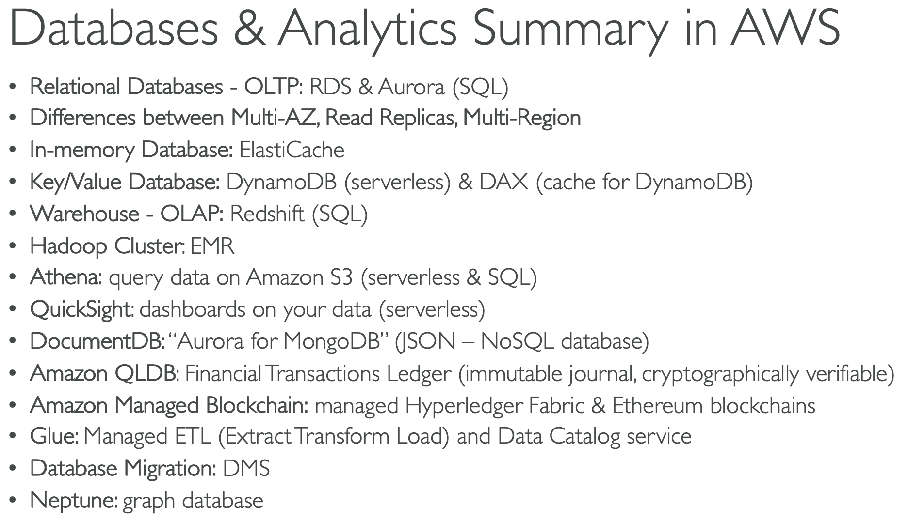

# Databases & Analytics
Characteristics:
- U can *structure* the data. 
- Build *indexes* to efficiently *query/search* through the data.*
- Define *relationships* between datasets

Examples:
- KV
- Document
- Graph
- In-memory
- Search DBs

Benefits:
- Quick provisioning, HA, Scaling
- Automated Backup & Restore, Ops, Upgrades

## RDS & Aurora
**RDS**: Relational Database Service; managed. Available:
- Postgres, MySQL, MariaDB, Oracle, Microsft SQL Server
- AWS Aurora
- Suitable for OLTP workloads

**Aurora**:
- Supports PostreSQL & MySQL
- Cloud optimized, 5X over MySQL, 3x over Postgres
- Proprietary tech from AWS

## Deployments
**Read Replicas**: scale the read workload of your DB (up to 5); write to the main
**Multi-Az**: HA; in case of failure; RW only to main; 1 other as failover
**Multi-Region**: writes happens across regions; for Disaster recovery

## ElastiCache Overview
Managed Redis or Memcached.
- **Caches** are *in-memory DBs* with HP, low lat
- Reduce load off DBs for *read intensive workloads*

## DynamoDB
Fully managed, HA with repl across 3 AZ. NoSQL. Massive workloads, "serverless" DB
- M of requests p/s, 100s TB 
- Fast & consistent, low latency
- IAM security (auth, admin)
- Low cost & AS capabilities
- Std & IA Table Class
- KV DB

DAX (DynamoDB Accelerator):
- Full managed, *in-memory cache*

### Global Tables
Make this tables accesible with low lat in multiple-regions
- **Active-Active** replication 

## Redshift (warehousing)
Based on PostgreSQL, not for OLTP (Online Transaction Processing).
it is OLAP (Online Analytical Processing) -> analytics & **data warehousing**
- Load data every hr
- Columnar storage
- Massively Paralell Query Execution (MPP), HA
- SQL interface
- Pay as you go
- Integration with BI (AWS Quicksight or Tableau)

## Elastic MapReduce (EMR)
Create Hadoop cluster (**Big Data**):
- Analyze & process vast amount of data
- Can be made of hundreds of EC2 instances
- Supports Apache Spark, HBase, Presto, Flinks
- It take cares of all the provisioning & config
- AS & integrated with Spot instances
- **For**: data processing, ML, web index, Big Data

## Amazon Athena
Serverless *query* service to **perform analytics against S3 objects**
- SQL lang
- Supports CSV, JSON, ORC, Avro, Parquet (Presto)
- Pricing $5 per TB scanned
- Use columnar to save costs
- Use case: BI/ Analytics/ reporting, analyze & query VPC Flow Logs, CloudTrail

## Amazon QuickSight
Serverless ML powered BI service to create **interactive dashboards**
- Fast, AS, embeddable, with per-session pricing
- Use cases: Business analytics, Building visualizations, Perform ad-hoc analysis, Get 
business insights using data
- RDS, Aurora, Athena, S3, RedShift

## DocumentDB
"Aurora" for MongoDB (store, query & index JSON data)
- Same "deployment concepts"
- Fully Managed, HA with replication across 3 AZ
- Storage grows in increments of 10 GB, up to 64 TB
- Workloads with millions of request per secs

## Amazon Neptune
Full managed **graph DB** for **group dataset** (e. g. a social net)
- HA across 3 AZ, up to 15 read replicas
- Highly connected datasets
- Store up to Bs of relations & query the graph with ms lat
- For: 
    - Knowledge graphs (Wikipedia)
    - Fraud detection
    - Recommendation engines
    - Social net

## Amazon QLDB (Quantom Ledger DB)
A **ledger**: book recording financial transactions
- Fully managed, serverless, HA, replication across 3 AZ
- **Review history** of all changes made to your app data
- **Inmutable**: not changes/delete, crypto verifiable
- Can also manipulate data using SQL
- Central DB

## Amazon Managed Blockchain
It makes possible to build apps where multiple parties can *execute transactions* **without the need for a** 
**trusted, central authority**
- Managed service to:
    - Join public blockchain net
    - Create your own private
- Compatible:
    - Hyperledger Fabric
    - Ethereum

## DMS (DB Migration Service)
- Quick & secure migration of DBs to AWS, resilient, self healing
- Source DB remains available during migration
- Types:
    - Homogeneous: from the same tech
    - Heterogeneous: diff DB tech

## AWS Glue
Managed **Extract, Transform, and Load** (ETL) service
- Prepared & transform data for analytics
- Serverless

**Glue Data Catalog**: catalog of datasets. Central repo to store structural & operational metadata for data
assets

## Summary
