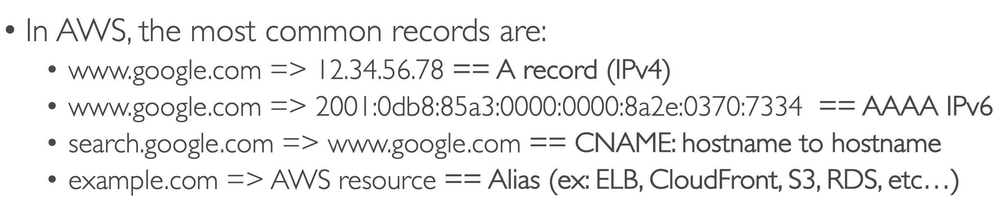
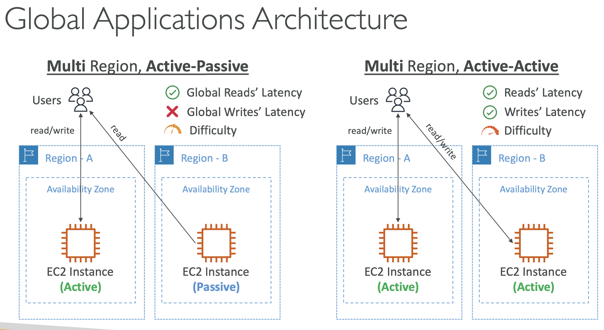

# Global Infrastructure
Reasons:
- Decreased latency
- Disaster recovery
- Attack protection

## Route S3
Managed DNS (collection of rules & records to help clients understand how to reach a server through URLs)
- Domain registration
- Routing Policy
- DNS
- Health checks

### Routing Policies
- Simple: no health check
- Weighted: like some LB
- Latency: communicate with the closest server
- Failover: redirect in case of failure

## CloudFront
Content Delivery Network (CDN)
- ^Read Performance, content is **cached at the edge**
- 216 Point of Presence
- DDoS protection, Shield, Web Application Firewall

Origins:
- S3 bucket
    - Distro files 
    - Origin Access Identity (OAI)
    - As an ingress (upload files to S3)
- Custom Origin:
    - App LB
    - EC2 instance
    - S3 website (static enabled)
    - HTTP backend

## S3 Transfer Acceleration
Put file to an Edge Location which will forward the data to the S3 bucket in the target region.

## AWS Global Accelerator
^ Global App availability & performance using the the AWS global network.
- Edge locations will route traffic to the nearest server.
- **2 Anycast IP** are created for your app.
- Static IP address
- Deterministic, fast regional failover

## AWS Outposts
"Server racks" that offers th same AWS system on-premises. AWS will go, setup & manage this in your own
on-premises infra. You are now responsible for the physical security.

Benefits:
- Low lat
- Local data processing
- Data residency
- Easier migration to the cloud

## AWS Wavelength
Infra deployments embedded within the telecom providers datacenters at the edge of 5G Nets.
- Ultra-low lat apps through 5G Nets
- Not add costs
- Doesn-t leave CSP Net
- High-Bandwidth, secure conn to parent AWS region
- Use cases: Smart Cities, AR/VR, Real-time gaming, Connected vehicles, ML-assisted diagnos, 

## AWS Local Zones
Put AWS compute, storage, DB, closer to **end users to run lat-sensitive apps**
- Extend your VPC to more locations
- EC2, RDS, ECS, EBS, ElastiCache... 

## Global App
