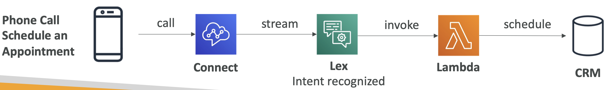
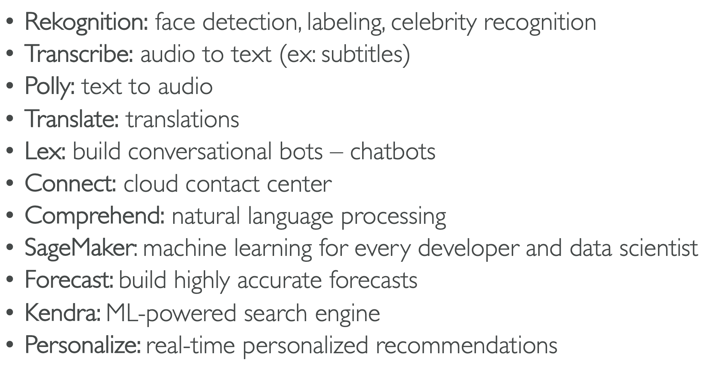

# Machine Learning 

## Amazon Rekognition
Find **objs, people, text, scenes** in multimedia (ML)
- Facial analysis & search (user verification, people counting)
- For: Labeling, content moderation, text detect, face detect & analysis, celebrity recognition

## Amazon Transcribe
Speech-to-text. Uses a DL process called **automatic speech recognition** (ASR) to
convert (quickly & accurately)
- Transcribe customer service calls
- Automate closed **captioning & subtitling**
- Generate metadata for **media assets**

## Amazon Polly
Text to lifelike speech using DL
- Create apps to talk

## Amazon Translate
Natural & accurate lang translation.
- **Localize content** for **international users**, and easily translate large
volumes of text efficiently

## Amazon Lex & Connect
- **Amazon Lex** (same tech as Alexa)
    - ASR
    - Natural Lang Understanding (NLU) to recognize the intent
    - Helps build chatbots, call center bots
    - Conversational interfaces
- **Amazon Connect**: 
    - Receive calls, create contact, flows, cloud-based **virtual contact center**
    - Integrates with other CRM systems or AWS

Example:

## Amazon Comprehend
For **NLP**. 
- Fully Managed, Serverless
- ML to find insights & relationships
    - Lang
    - Key phrases, places, people, brands, or events
    - Sentiment analysis
    - Uses tokenization
    - Organizes by topic

## Amazon SageMaker
Fully Managed svc for devs/data scientists to build ML models.
A full place to manage all the processes.
- Quick.

## Amazon Forecast
Fully Managed. Highly accurate ML forecast.
- For: Product Demand Planning, Financial Planning

## Amazon Kendra
Document search svc (ML).
- Fully managed.
- Extract answers (text, PDF, Word, HTML, PowerPoint)
- **Incremental learning** (learn from interaction)
- Manually fine-tine results

## Amazon Personalize
Build apps with real-time personalized recommendations
- Fully Managed
- Intregation: websistes, apps, SMS, email

